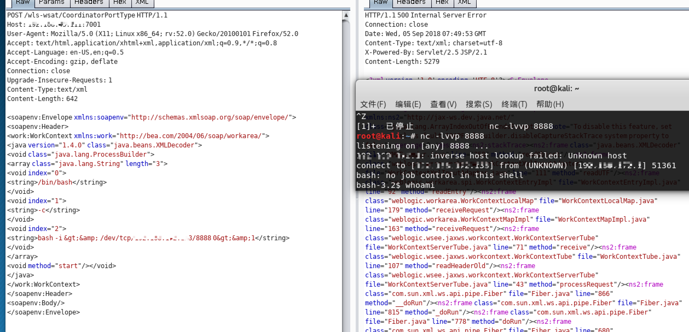
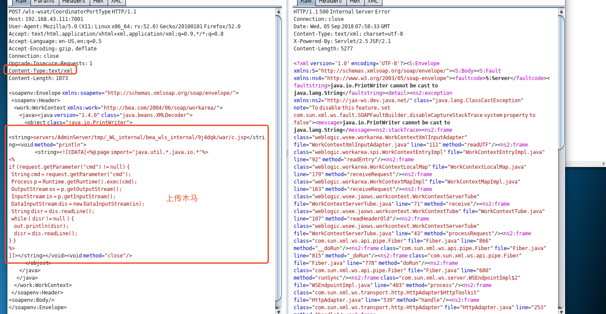

## weblogic xmlDecoder反序列化漏洞 cve-2017-3506&cve-2017-10271

## 1.漏洞信息

| 项目     | 描述                                                         |
| -------- | ------------------------------------------------------------ |
| 漏洞名称 | Apache Tomcat Remote Code Execution                          |
| CVE编号  | CVE-2016-8735                                                |
| 漏洞描述 | 早期，黑客利用WebLogic WLS 组件漏洞对企业服务器发起大范围远程攻击，有大量企业的服务器被攻陷，且被攻击企业数量呈现明显上升趋势，需要引起高度重视。其中，CVE-2017-3506是一个利用Oracle WebLogic中WLS 组件的远程代码执行漏洞，属于没有公开细节的野外利用漏洞，大量企业尚未及时安装补丁。官方在 2017 年 4 月份就发布了该漏洞的补丁。 |
| 影响范围 | Oracle WebLogic Server10.3.6.0.0 版本；Oracle WebLogic Server12.1.3.0.0 版本；Oracle WebLogic Server12.2.1.1.0 版本；Oracle WebLogic Server12.2.1.2.0 版本 |

#### 2.漏洞复现

###### 2.1.环境搭建

参见weblogic环境搭建

所需weblogic版本10.3.6

###### 2.2复现漏洞

2.2.1访问http://your-ip:7001/wls-wsat/CoordinatorPortType

如图发送payload,添加Content-Type:text/xml和soap请求



2.2.2利用漏洞上传小马



###### 3.问题现象


#### .weblogic XMLDecoder源码解析

1.wls-wsat.war提供的web service服务，通过WLSServletAdapter进行处理，然后在WorkContextServerTube.processRequest类中进行处理POST数据包中的XML数据，主要功能是分割xml，抽取真正的xml交给readHeadOld方法

```
public NextAction processRequest(Packet var1) {
    this.isUseOldFormat = false;
    if (var1.getMessage() != null) {
        HeaderList var2 = var1.getMessage().getHeaders();
        Header var3 = var2.get(WorkAreaConstants.WORK_AREA_HEADER, true);
        if (var3 != null) {
            this.readHeaderOld(var3);//处理真正的xml
            this.isUseOldFormat = true;
        }

        Header var4 = var2.get(this.JAX_WS_WORK_AREA_HEADER, true);
        if (var4 != null) {
            this.readHeader(var4);
        }
    }

    return super.processRequest(var1);
}
```

2.使用WorkContextXmlInputAdapter处理传过来的poc

```
protected void readHeaderOld(Header var1) {
    try {
        XMLStreamReader var2 = var1.readHeader();
        var2.nextTag();
        var2.nextTag();
        XMLStreamReaderToXMLStreamWriter var3 = new XMLStreamReaderToXMLStreamWriter();
        ByteArrayOutputStream var4 = new ByteArrayOutputStream();
        XMLStreamWriter var5 = XMLStreamWriterFactory.create(var4);
        var3.bridge(var2, var5);
        var5.close();
        WorkContextXmlInputAdapter var6 = new WorkContextXmlInputAdapter(new ByteArrayInputStream(var4.toByteArray()));//此处的var4会被替换成poc
        this.receive(var6);
    } catch (XMLStreamException var7) {
        throw new WebServiceException(var7);
    } catch (IOException var8) {
        throw new WebServiceException(var8);
    }
}
```

3.发现是xml会被传递到XMLDecoder中

```
public WorkContextXmlInputAdapter(InputStream var1) {
    this.xmlDecoder = new XMLDecoder(var1);
}
```

 4.查看xmlDecoder的readObject方法

```
public Object readObject() {
    return (parsingComplete())
            ? this.array[this.index++]
            : null;
}
```


 5.查看关键代码paringComplete方法

```
private boolean parsingComplete() {
    if (this.input == null) {
        return false;
    }
    if (this.array == null) {
        if ((this.acc == null) && (null != System.getSecurityManager())) {
            throw new SecurityException("AccessControlContext is not set");
        }
        AccessController.doPrivileged(new PrivilegedAction<Void>() {//将代码标记为特权
            public Void run() {
                XMLDecoder.this.handler.parse(XMLDecoder.this.input);//此处进行反序列化操作
                return null;
            }
        }, this.acc);
        this.array = this.handler.getObjects();
    }
    return true;
}
```

 6.由于xml内容可控，因此攻击人可构造恶意的xml，造成反序列化攻击。

```
public void parse(final InputSource var1) {
    if (this.acc == null && null != System.getSecurityManager()) {
        throw new SecurityException("AccessControlContext is not set");
    } else {
        AccessControlContext var2 = AccessController.getContext();
        SharedSecrets.getJavaSecurityAccess().doIntersectionPrivilege(new PrivilegedAction<Void>() {
            public Void run() {
                try {
                
                    SAXParserFactory.newInstance().newSAXParser().parse(var1, DocumentHandler.this);
                } catch (ParserConfigurationException var3) {
                    DocumentHandler.this.handleException(var3);
                } catch (SAXException var4) {
                    Object var2 = var4.getException();
                    if (var2 == null) {
                        var2 = var4;
                    }

                    DocumentHandler.this.handleException((Exception)var2);
                } catch (IOException var5) {
                    DocumentHandler.this.handleException(var5);
                }

                return null;
            }
        }, var2, this.acc);
    }
}
```

###### 3506的补丁的分析

在weblogic/wsee/workarea/WorkContextXmlInputAdapter.java中，
添加了validate方法，方法的实现如下：

```
private void validate(InputStream is) {
      WebLogicSAXParserFactory factory = new WebLogicSAXParserFactory();

      try {
         SAXParser parser = factory.newSAXParser();
         parser.parse(is, new DefaultHandler() {
            public void startElement(String uri, String localName, String qName, Attributes attributes) throws SAXException {
               if(qName.equalsIgnoreCase("object")) {
               //在解析xml的过程中，如果Element字段值为Object就抛出异常
                  throw new IllegalStateException("Invalid context type: object");
               }
            }
         });
      } catch (ParserConfigurationException var5) {
         throw new IllegalStateException("Parser Exception", var5);
      } catch (SAXException var6) {
         throw new IllegalStateException("Parser Exception", var6);
      } catch (IOException var7) {
         throw new IllegalStateException("Parser Exception", var7);
      }
   }
```

由于这个补丁只是简单的判断object，很好绕过，于是很快官方更新了10271的补丁

###### 10271的补丁分析

```
private void validate(InputStream is) {
   WebLogicSAXParserFactory factory = new WebLogicSAXParserFactory();

   try {
      SAXParser parser = factory.newSAXParser();
      parser.parse(is, new DefaultHandler() {
         private int overallarraylength = 0;

         public void startElement(String uri, String localName, String qName, Attributes attributes) throws SAXException {
            if(qName.equalsIgnoreCase("object")) {//杜绝了object
               throw new IllegalStateException("Invalid element qName:object");
            } else if(qName.equalsIgnoreCase("new")) {//杜绝了new 
               throw new IllegalStateException("Invalid element qName:new");
            } else if(qName.equalsIgnoreCase("method")) {//杜绝了method
               throw new IllegalStateException("Invalid element qName:method");
            } else {
               if(qName.equalsIgnoreCase("void")) {//杜绝了void
                  for(int attClass = 0; attClass < attributes.getLength(); ++attClass) {
                     if(!"index".equalsIgnoreCase(attributes.getQName(attClass))) {
                        throw new IllegalStateException("Invalid attribute for element void:" + attributes.getQName(attClass));
                     }
                  }
               }

               if(qName.equalsIgnoreCase("array")) {
                  String var9 = attributes.getValue("class");
                  if(var9 != null && !var9.equalsIgnoreCase("byte")) {
                     throw new IllegalStateException("The value of class attribute is not valid for array element.");
                  }
```

10271d的补丁限定了object，new，method，void，array等字段，就限定了不能生成java 的实例，之前测试用例不能执行