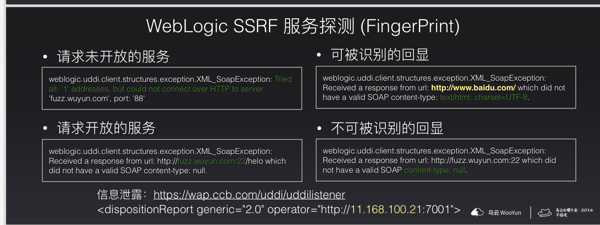

## weblogic ssrf漏洞

#### 1.环境搭建

参见weblogic环境搭建

weblogic版本：10.3.6

#### 2.漏洞复现

###### 2.1漏洞简介

weblogic中存在一个ssrf漏洞，利用该漏洞可以发送任意http请求，进而攻击内网中redis等脆弱组件

其漏洞原理为应用程序在加载用户提供的url时，未进行地址检验直接发起了对第三方服务器的请求，并将结果状态返回客户端



###### 2.2结合redis实现ssh免密登陆

攻击流程：

攻击机生成自己的私钥---->通过weblogic向靶机1发送get请求，内容为url编码后的redis命令--->靶机1收到http请求后，解析请求，和靶机2建立连接，传输数据--->靶机2收到soap请求，执行redis命令，在靶机/root/.ssh目录下生成authorized_keys的文件，文件内容为攻击机的公钥--->攻击机可以通过ssh命令登陆靶机主机

  

#### 3.源码分析weblogic ssrf漏洞

###### 1.http参数中的operator变量被传输到SearchPublicRegistries.jsp中

```
search.setOperator(operator);//设置operator的值
```

###### 2.查看Search类中的setOperators方法

```
public void setOperator(String var1) {
    try {
        this.m_operator = var1;//设置Search.m_operator为operator对应的url
        this.setUDDIInquiryURL(var1);//设置InquiryURL的值
    } catch (Exception var4) {
        String var3 = (new UDDITextFormatter()).uddiExplorerSearchOpException();
        this.log.error(var3, var4);
    }

}
```

###### 3.设置inquiry类实例的成员变量URL为url

```
public void setUDDIInquiryURL(String var1) {
    this.UDDI_INQUIRY_URL = var1;//设置Search的UDDI_INQUIRY_URL为url
    this.m_inquiry.setURL(this.UDDI_INQUIRY_URL);
}
```

###### 4.回到Search类的getResponse方法
```
public Object getResponse(String rdoSearch, String name, String key, String sfor, String option) throws UDDIException, XML_SoapException {
        Object tmp = null;
        if (rdoSearch.equalsIgnoreCase("name")) {
            tmp = this.findBusinessListByName(name);//漏洞触发的关键函数
        }
        .....
   }
```
5.查看Search类的findBusinessListByName方法

	private BusinessList findBusinessListByName(String name) throws UDDIException, XML_SoapException {
	    BusinessList business = null;
	    FindBusiness findBusiness = new FindBusiness();
	    findBusiness.setName(new Name(name));
	    business = this.m_inquiry.findBusiness(findBusiness);//inquiry类实例对象调用findBussiness方法
	    return business;
	}
6.此处UUDsoapMessage类对象调用的sendMessage传入了我们之前传入的url

```
public BusinessList findBusiness(FindBusiness var1) throws UDDIException, XML_SoapException {
    UDDISoapMessage var2 = new UDDISoapMessage();
    var2.sendMessage(FindBusinessDOMBinder.toDOM(var1, var2.createDOMDoc()), this.getURL());//此处getURL返回的URL即inquiry实例对象的url，即前面我们http参数传入的url
    if (var2.isFault()) {
        throw UDDIExceptionDOMBinder.fromDOM(var2.getResult());
    } else {
        BusinessList var3 = BusinessListDOMBinder.fromDOM(var2.getResult());
        return var3;
    }
}
```

7.senMessage已经接近核心了，单步调试下来发现先是对Header之类的处理拼接，然后发送soap请求

```
public void sendMessage(Element var1, String var2) throws XML_SoapException {
    System.setProperty("javax.xml.soap.MessageFactory", "weblogic.webservice.core.soap.MessageFactoryImpl");

    try {//send请求之前的函数基本都是对soap请求内容的构造相关函数
        DefaultMessageContext var3 = new DefaultMessageContext();
        SOAPMessage var4 = var3.getMessage();
        MimeHeaders var5 = var4.getMimeHeaders();
        var5.addHeader("soapAction", "\"\"");
        SOAPPart var6 = var4.getSOAPPart();
        SOAPEnvelope var7 = var6.getEnvelope();
        SOAPBody var8 = var7.getBody();
        SOAPElement var9 = var8.addChildElement(var1.getTagName());
        this.populateSOAPElement(var7, var9, var1);
        BindingFactory var10 = BindingFactory.getInstance();
        BindingInfo var11 = new BindingInfo();
        var11.setAddress(var2);
        Binding var12 = var10.create(var11);
        var12.send(var3);//发送soap请求
        ....
    }
```

8.查看关键的send函数(Http11ClientBinding.class)

```
public void send(MessageContext paramMessageContext)
    throws IOException, SOAPException
  {
   ....
      this.outputStream = this.connection.getOutputStream();//建立连接对应的connection
      this.outputStream.write((byte[])localObject2);
   
  }
  
```

9.再定位下什么时候传输数据（HttpURLConnection.class)

```
protected synchronized void writeRequests() throws IOException {
    if (!this.wroteRequests) {
        this.wroteRequests = true;
        if (!this.setRequests) {
            this.doSetRequests();
        }

        this.requests.print(this.http.getOutputStream());
        this.http.getOutputStream().flush();//此处完成数据的传输
        if (debug) {
            p("wrote request - " + this.requests);
        }
```

